Here a few screenshots from the controller UI:

Boot messages:

Main screen:

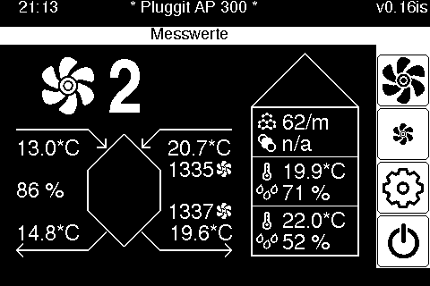

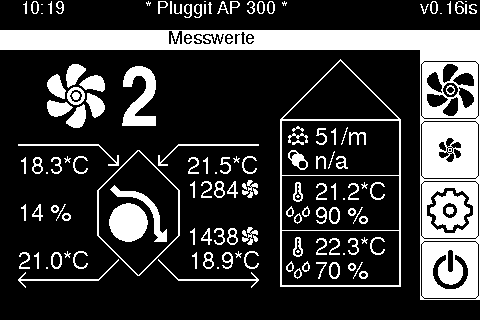
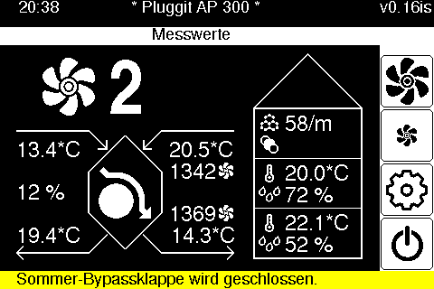
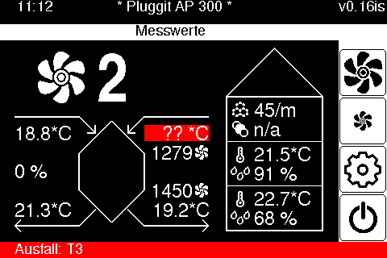

Calibration screen:

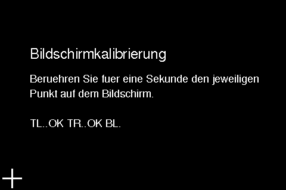

Setup screen:

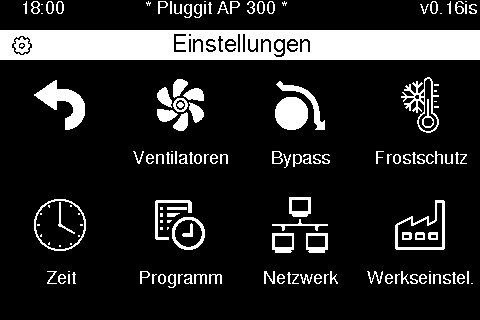

Fan setup screen:

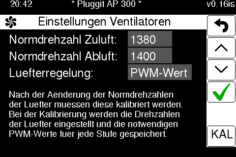
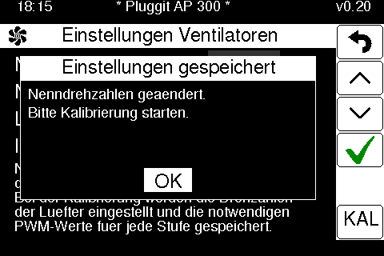
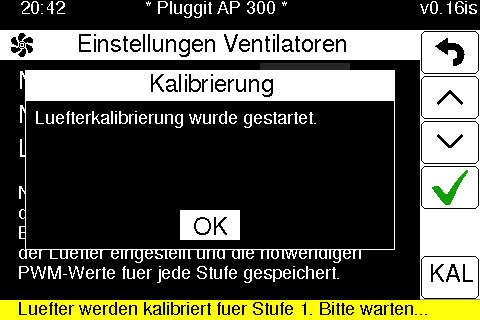

Summer bypass setup screen:

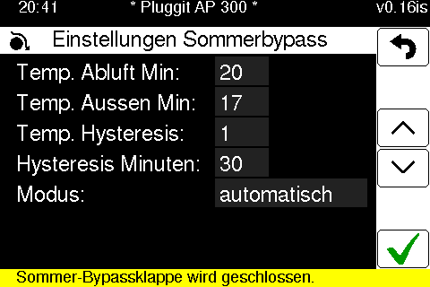

Antifreeze setup screen:

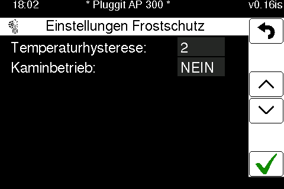

Timezone and DST setup screen:

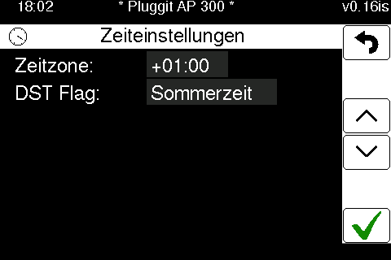

Program manager screen:

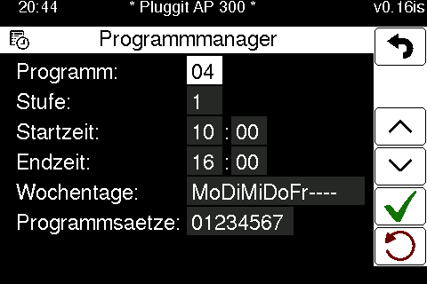
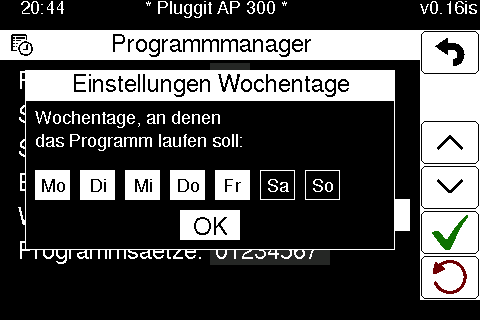
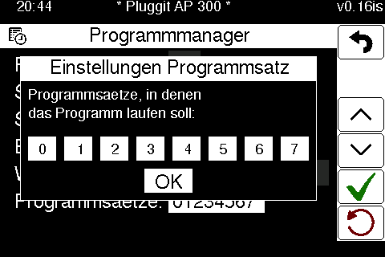

Network settings screen:

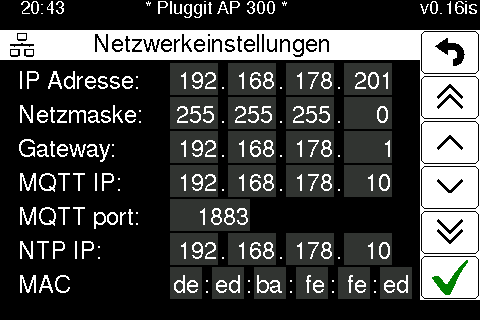

Factory defaults screen:

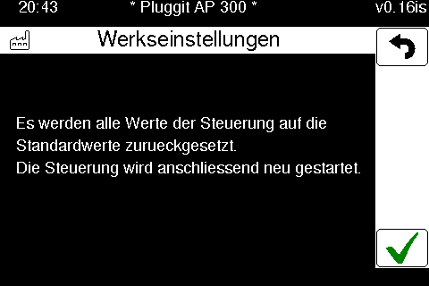

